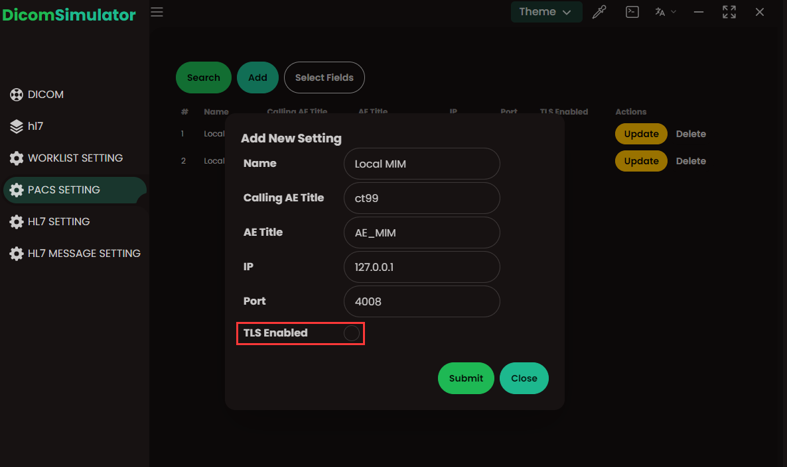

# DICOM-SIMULATOR-DESKTOP-APP

## 描述




dicon-simulator 的桌面模拟器版本

1.支持拉取工作列表
2.支持MPPS
3.支持C-STORE
4.可配置
5.支持多语言，多主题
5.支持TLS功能（需要替换resources/certs目录下的文件）

TODO:
1.自定义脚本内容
2.UPS


## 初始化项目

> NOTE: 本项目依赖rust开发环境，需要先安装rust环境
> NOTE: 本项目依赖python开发环境，需要先安装python环境，或者下载python312，解压到项目目录

```shell
# Install front-end dependencies
pnpm install

# Start the development server (may take longer on the first run)
pnpm tauri dev

# Build the executable, supporting platforms like Windows and macOS
pnpm tauri build


### Optimizations Made
- Improved the overall structure and flow for clarity.
- Added headings for easier navigation.
- Broadened the descriptions for each feature for better understanding.
- Included clear instructions and formatted the shell commands in a more readable fashion.
```
